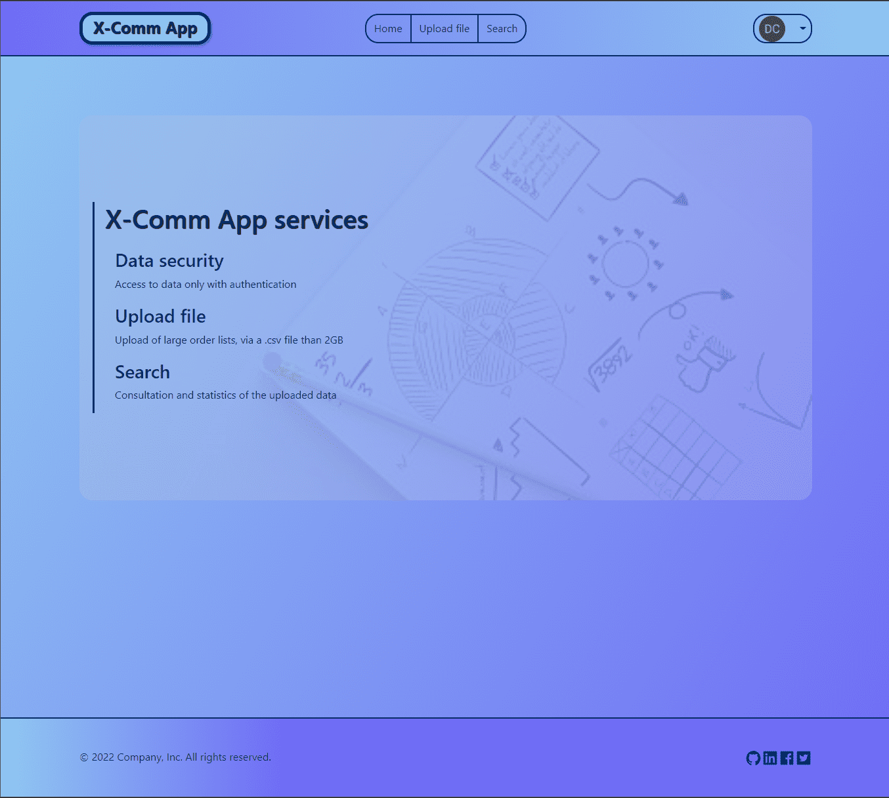
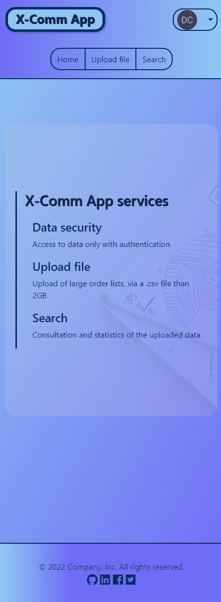
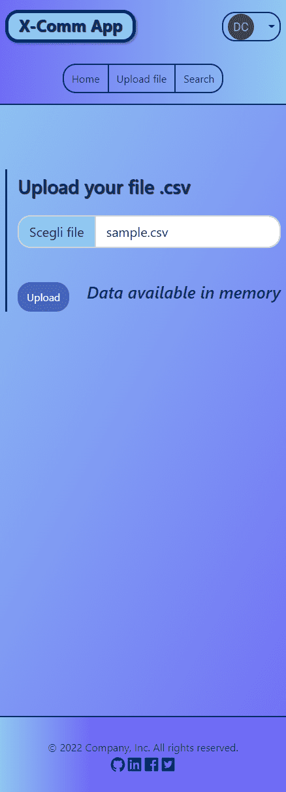
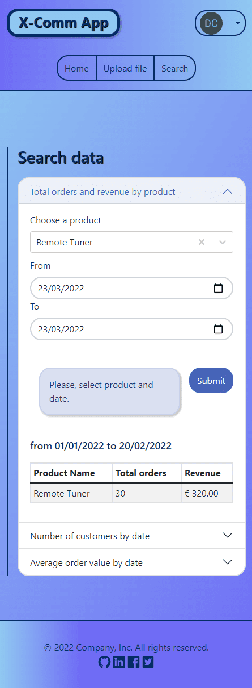

<div id="top" align="center">
  
  
  
  
</div>
&#xa0;

<hr/>

<div align="center">
  
</div>

<hr/>

  <p>Deploy:
<a href="https://x-comm-app.netlify.app/">x-comm-app.netlify.app/</a>
</div>

<p align="center">
  

  

  

  
</p>

<p align="center">
  <a href="#pushpin-about">About</a> &#xa0; | &#xa0; 
  <a href="#pushpin-technologies">Technologies</a> &#xa0; | &#xa0;
  <a href="#pushpin-requirements">Requirements</a> &#xa0; | &#xa0;
  <a href="#memo-license">License</a> &#xa0; | &#xa0;
  <a href="https://github.com/cavaglieridomenico" target="_blank">Author</a>
</p>

<br>

## :pushpin: About

This is the interface of this [application](https://github.com/tomorrowdevs-projects/team2-real-world-app).<br>
The purpose of the whole project is to create a Web App for an Ecommerce, where after logging in, you can upload a file larger than 2GB with the ability to run queries on it.<br>
<br>
The interface is a single page application built with React.<br>
Main features implemented:<br>
useReducer, useContext, useRef, Router 6.
<br>
The development followed the <a href="https://github.com/tomorrowdevs-projects/team2-real-world-app/projects" target="_blank">project tasks</a>.

## :pushpin: Technologies

The following tools were used in this project:

- [React](https://reactjs.org//)
- [React Bootstrap](https://react-bootstrap.github.io/)
- [Sass](https://sass-lang.com/)
- [Javascript](https://www.ecma-international.org/publications-and-standards/standards/ecma-262/)
- [CSS](https://www.w3.org/Style/CSS/)
- [HTML](https://html.spec.whatwg.org/multipage/)
- [Firebase](https://firebase.google.com/)
- [Webpack](https://webpack.js.org/)
- [Jest](https://jestjs.io/)
- [Node.js](https://nodejs.org/en/)
- [npm](https://docs.npmjs.com/)

## :pushpin: Requirements

<h2>for local installation</h2>

Before starting, you need to have [Node](https://nodejs.org/en/) installed.

<h2>Starting</h2>

```bash
# Access
$ choose the client folder

# Install dependencies
$ npm install

# Run the project in dev mode (Webpack Dev Server localhost:3000)
$ npm start

# Launches the test runner in the interactive watch mode.
$ npm test

# Builds the app for production to the `build` folder.
# It correctly bundles React in production mode and optimizes the build for the best performance.
# The build is minified and the filenames include the hashes.
$ npm run build
```

<h2>for Docker container (dev mode)</h2>

Before starting, you need to have [Docker Desktop](https://www.docker.com/products/docker-desktop/) installed.

<h2>Starting</h2>

```bash
# Access
$ choose the root

# Start the application in a Docker container in development mode.
$ docker-compose up

```

## :memo: License

This project is under license from MIT. For more details, see the [LICENSE](LICENSE.md) file.

&#xa0;

<a href="#top">Back to top</a>
